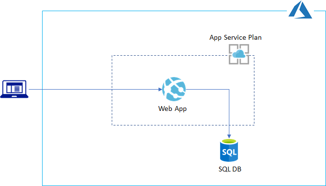

# Terraform Sample for Azure PaaS (WebApp & MS SQL)

One of challenges for provisioning PaaS services is deploying applications since `terraform` does not provide native way of deploying apps (e.g, Web App and setup MS SQL). This sample terraform shows how to deploy and configure webapps and MS SQL using `terraform`.



## Provision services

This terraform sample creates following Azure services

- MS SQL (SQL Server & Database)
- Web App with App Service plan

## Deploy/Setup app

> Default execution environment is _Azure Cloud Shell_. If you want to run it on Windows than you need to enable `deploy_ps.tf` (i.e.: `deploy_ps.tf_ -> deploy.ps.tf, deploy_sh.tf -> deploy_sh.tf_`) and install `sqlcmd` tool.

There are two ways to deploy application

### Zip deploy 

[zip deploy](https://docs.microsoft.com/en-us/azure/app-service/deploy-zip) using [local_exec](https://www.terraform.io/docs/provisioners/local-exec.html). This is _personally_ recommended way if you're using TF.

```
resource "null_resource" "apiapp" {
  provisioner "local-exec" {
    command = "curl -s -X POST -T ./assets/apiapp.zip -u '${azurerm_app_service.tfrg.site_credential[0].username}:${azurerm_app_service.tfrg.site_credential[0].password}' https://${azurerm_app_service.tfrg.name}.scm.azurewebsites.net/api/zipdeploy"
    interpreter = ["/bin/bash", "-c"]
  }

  depends_on = [azurerm_app_service.tfrg]
}
```

> For addiional information, please refer [zip deploy on KUDU wiki](https://github.com/projectkudu/kudu/wiki/Deploying-from-a-zip-file-or-url)

### ARM Template deploy

This is not _personally_ recommended way for this sample but if you cannot find terraform native way for Azure setting than ARM template is the only option you have.

> To run ARM template deploy, set `zipdeploy = false` in `variable.tf`.

[ARM template deployment](https://docs.microsoft.com/en-us/azure/app-service/deploy-resource-manager-template) using `extensions/msdeploy` provider

```
resource "azurerm_template_deployment" "tfrg" {
  name                = "${var.prefix}-appdeploy"
  resource_group_name = azurerm_resource_group.tfrg.name

  template_body = file(var.webapp_template_path)

  # these key-value pairs are passed into the ARM Template's `parameters` block
  parameters = {
    appName = azurerm_app_service.tfrg.name
    hostingPlanName = azurerm_app_service_plan.tfrg.name
    packageUri = var.package_url
  }

  deployment_mode = "Incremental"

  depends_on = [azurerm_app_service.tfrg]
}
```

Note that if you're using dotnet core app than you need to remove `unix` lib folder in `runtime` folder. Otherwise you'll get following error: 

```
Error waiting for deployment: Code="DeploymentFailed" Message="At least one resource deployment operation failed. Please list deployment operations for details. ... \"Package deployment failed\\r\\nAppGallery Deploy Failed: 'System.IO.DirectoryNotFoundException: Could not find a part of the path 'D:\\\\home\\\\site\\\\wwwroot\\\\runtimes\\\\unix\\\\'.\\r\\n`
```

## Config app

- Setup SQL Firewall (Enable Accessing Azure Services) and client PC
- Setup MSSQL using [sqlcmd](https://docs.microsoft.com/en-us/sql/tools/sqlcmd-utility?view=sql-server-ver15)
- Store `sql connections string` in Web App _app_settings_ 

## Test app

```
curl https://hostname.azurewebsites.net/api/events

curl -X POST https://hostname.azurewebsites.net/api/events -H "Content-Type: application/json" -d '{"message": "test"}'

curl https://hostname.azurewebsites.net/api/events
```